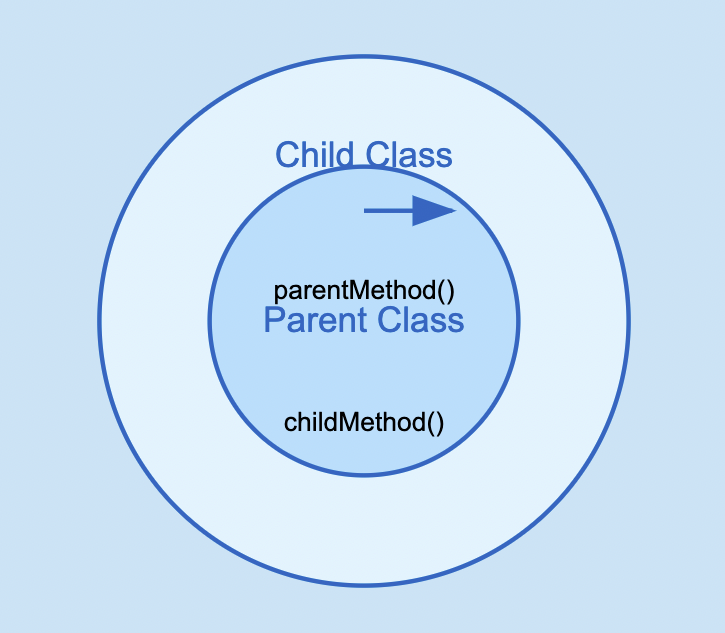

# 다형성 1
<br>

## 1. 다형성
***! key point***
<br>`한 객체가 여러 타입의 객체로 취급될 수 있는 능력`

### 1.1 다형적 참조
부모타입은 자식을 참조할 수 있지만 (자식의 인스턴스를 담을 수 있지만) <br>
자식타입은 부모를 참조할 수 없다. (부모의 인스턴스를 담을 수 없다.)




클래스를 '집합' 이라고 생각했을 때,<br>
Child 는 Parent 의 모든 기능을 포함하고 있으므로, Parent는 Child의 부분 집합이 된다. <br>
부모타입으로 자식을 담는 

```java
 System.out.println("parent -> child");
        Parent poly = new Child();
        poly.parentMethod();
        // poly.childMethod(); 이건 안됨.
        // 부모타입은 자식을 참조할 수 있다.
```

이와같은 형태를 `다형적 참조` 라고 한다. <br>
또한, 다형적 참조를 통해 Parent 타입에 Child를 참조하는 경우, Child의 메서드는 사용할 수 없다.<br>


### 1.2 다형성과 캐스팅
```java
// 다형적 참조
Parent poly = new Child();
// 다운캐스팅(부모 타입 -> 자식 타입)
Child child = (Child) poly;
child.childMethod();
```

***실행순서***
```java
Child child = (Child) poly;
Child child = (Child) x001;
Child child = x001;
```

`poly 의 참조값의 타입을 Child 로 변경한 뒤 참조한다.`


**일시적 다운캐스팅**
```java
// 다운캐스팅(부모 타입 -> 자식 타입)
((Child) poly).childMethod();
```

**업캐스팅**
```java
Child child = new Child();
Parent parent1 = (Parent) child; // 생략 가능(권장)
```


### 1.3 다운캐스팅 주의점

```java
Parent parent1 = new Child();
        Child child1 = (Child) parent1;
        child1.childMethod();
        // 가능!
        
        Parent parent2 = new Parent();
        Child child2 = (Child) parent2;
        child2.childMethod(); // 런타임 에러
        // 헉! 불가능!
        // Exception in thread "main" java.lang.ClassCastException: Section11.poly.basic.Parent incompatible with Section11.poly.basic.Child
        // at Section11.poly.basic.CastingMain4.main(CastingMain4.java:11)
```
생성된 Parent 인스턴스에는 Child 의 메서드가 존재하지 않는다. <br>
따라서, 다운캐스팅을 통해 부모 인스턴스에서 자식의 메서드를 호출하면 런타임 에러가 발생한다.<br>
업캐스팅의 그럴 걱정이 없는데, `반드시` 자식 타입은 부모타입의 인스턴스를 상속받아 전부 가지고 있기 때문.


### 1.4 Instanceof : "이 객체가 해당 집합에 속하는가 ?"
```java
public static void main(String[] args) {
        Parent parent1 = new Parent();
        call(parent1);
        Parent parent2 = new Child();
        call(parent2);
    }

    private static void call(Parent parent) {
        if(parent instanceof Child){
            System.out.println("Child instance");
            Child child = (Child) parent;
            child.childMethod();
        } else {
            System.out.println("nono;;");
            parent.parentMethod();
        }
    }
```
해당 객체가 Child 인스턴스인지 체크한 뒤 다운캐스팅을 진행.

***자바 16버전 부터는...***
```java
private static void call(Parent parent) {
        if(parent instanceof Child child){
            System.out.println("Child instance");
            child.childMethod();
        } else {
            System.out.println("nono;;");
            parent.parentMethod();
        }
    }
```
instanceof 뒤에 변수 선언이 가능하다. `(Pattern Matching for instanceof)`


### 1.4 다형성과 메서드 오버라이딩
***! KeyPoint : 오버라이딩 된 메서드가 항상 우선권을 가진다.***

```java
// 자식이 자식참조
        Child child = new Child();
        System.out.println("child -> child");
        System.out.println("value = " + child.value);
        child.method();
//value = child
//Child.method

        // 부모가 부모참조
        Parent parent = new Parent();
        System.out.println("parent -> parent");
        System.out.println("value = "+ parent.value);
        parent.method();
//value = parent
//Parent.method

        // 부모가 자식참조
        Parent ov = new Child();
        System.out.println("parent -> parent");
        System.out.println("value = "+ov.value);
        ov.method();
//value = parent
///Child.method
```

부모타입으로 자식 인스턴스를 참조했을 때 자식 인스턴스에 오버라이딩 된 메서드가 있다면,<br>
오버라이딩 된 메서드를 호출한다.
